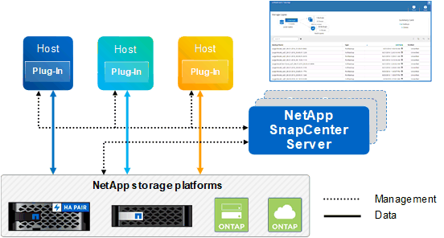

= Panoramica di SnapCenter
:allow-uri-read: 
:icons: font
:imagesdir: ../media/

[role="lead"]
Il software SnapCenter è una piattaforma semplice, centralizzata e scalabile che offre una protezione dei dati coerente con l'applicazione per applicazioni, database, file system host e macchine virtuali in esecuzione su sistemi ONTAP in qualsiasi punto del cloud ibrido.

SnapCenter sfrutta le tecnologie NetApp Snapshot, SnapRestore, FlexClone, SnapMirror e SnapVault per fornire quanto segue:

* Backup rapidi, efficienti in termini di spazio, coerenti con le applicazioni e basati su disco
* Ripristino rapido e granulare e ripristino coerente con l'applicazione
* Cloning rapido ed efficiente in termini di spazio

SnapCenter include sia il server SnapCenter che singoli plug-in leggeri. È possibile automatizzare la distribuzione dei plug-in agli host delle applicazioni remote, pianificare le operazioni di backup, verifica e clonazione e monitorare tutte le operazioni di protezione dei dati.

SnapCenter può essere implementato nei seguenti modi:

* On-premise per proteggere:
+
** Dati presenti nei sistemi primari ONTAP FAS o AFF e replicati nei sistemi secondari ONTAP FAS o AFF
** Dati sui sistemi primari ONTAP Select
** Dati su sistemi primari e secondari ONTAP FAS o AFF e protetti dallo storage a oggetti StorageGRID locale (utilizzando l'integrazione del backup cloud NetApp BlueXP)

* On-premise in un cloud ibrido per proteggere:
+
** Dati presenti nei sistemi primari ONTAP FAS o AFF e replicati in Cloud Volumes ONTAP
** Dati che si trovano su sistemi primari e secondari ONTAP FAS o AFF e protetti per lo storage di oggetti e archivi nel cloud (utilizzando l'integrazione di NetApp BlueXP Cloud Backup)

* In un cloud pubblico per proteggere:
+
** Dati presenti nei sistemi primari Cloud Volumes ONTAP (in precedenza cloud ONTAP)
** Dati presenti su Amazon FSX per ONTAP

SnapCenter include le seguenti funzionalità principali:

* Protezione dei dati centralizzata e coerente con l'applicazione
+
La protezione dei dati è supportata per i database Microsoft Exchange Server, Microsoft SQL Server, Oracle su Linux o AIX, il database SAP HANA e i file system host Windows in esecuzione sui sistemi ONTAP.

+
La protezione dei dati è supportata anche per altre applicazioni e database standard o personalizzati fornendo un framework per creare plug-in SnapCenter definiti dall'utente. Ciò consente la protezione dei dati per altre applicazioni e database dallo stesso singolo pannello di controllo. Sfruttando questo framework, NetApp ha rilasciato plug-in personalizzati SnapCenter per IBM DB2, MongoDB, MySQL e così via sul NetApp Automation Store.

+
https://automationstore.netapp.com/home.shtml["Storage Automation Store di NetApp"^]

* Backup basati su policy
+
I backup basati su policy sfruttano la tecnologia di copia Snapshot di NetApp per creare backup rapidi, efficienti in termini di spazio, coerenti con le applicazioni e basati su disco. Facoltativamente, è possibile automatizzare la protezione di questi backup nello storage secondario mediante aggiornamenti alle relazioni di protezione esistenti.

* Backup di più risorse
+
Utilizzando i gruppi di risorse SnapCenter è possibile eseguire contemporaneamente il backup di più risorse (applicazioni, database o file system host) dello stesso tipo.

* Ripristino e ripristino
+
SnapCenter offre ripristini rapidi e granulari dei backup e recovery basato sul tempo e coerente con l'applicazione. È possibile eseguire il ripristino da qualsiasi destinazione nel cloud ibrido.

* Cloning
+
SnapCenter offre una clonazione rapida, efficiente in termini di spazio e coerente con le applicazioni, che consente uno sviluppo software accelerato. Puoi clonare su qualsiasi destinazione nel cloud ibrido.

* Interfaccia grafica utente (GUI) di gestione utente singola
+
L'interfaccia grafica di SnapCenter offre un'unica interfaccia per la gestione di backup e cloni di una risorsa in qualsiasi destinazione nel cloud ibrido.

* API REST, cmdlet Windows, comandi UNIX
+
SnapCenter include API REST per la maggior parte delle funzionalità per l'integrazione con qualsiasi software di orchestrazione e l'utilizzo di cmdlet e interfaccia a riga di comando di Windows PowerShell.

+
Per ulteriori informazioni sulle API REST, vedere https://docs.netapp.com/us-en/snapcenter/sc-automation/overview_rest_apis.html["Panoramica delle API REST"].

+
Per ulteriori informazioni sui cmdlet di Windows, vedere https://library.netapp.com/ecm/ecm_download_file/ECMLP2885482["Guida di riferimento al cmdlet del software SnapCenter"^].

+
Per ulteriori informazioni sui comandi UNIX, vedere https://library.netapp.com/ecm/ecm_download_file/ECMLP2885486["Guida di riferimento al comando software SnapCenter"^].

* Data Protection centralizzata Dashboard e reporting
* RBAC (Role-Based Access Control) per la sicurezza e la delega.
* Database di repository con disponibilità elevata
+
SnapCenter offre un database repository integrato con alta disponibilità per memorizzare tutti i metadati di backup.

* Installazione push automatica dei plug-in
+
È possibile automatizzare un push remoto dei plug-in SnapCenter dall'host del server SnapCenter agli host delle applicazioni.

* Alta disponibilità
+
L'alta disponibilità per SnapCenter viene impostata utilizzando un bilanciamento del carico esterno (F5). Nello stesso data center sono supportati fino a due nodi.

* Disaster Recovery (DR)
+
È possibile ripristinare il server SnapCenter in caso di disastri come danneggiamento delle risorse o crash del server.

== Architettura SnapCenter

La piattaforma SnapCenter è basata su un'architettura a più livelli che include un server di gestione centralizzato (server SnapCenter) e un host plug-in SnapCenter.

SnapCenter supporta data center multisito. Il server SnapCenter e l'host plug-in possono trovarsi in diverse posizioni geografiche.

== Componenti SnapCenter

SnapCenter è costituito dal server SnapCenter e dai plug-in SnapCenter. Installare solo i plug-in appropriati per i dati che si desidera proteggere.

* Server SnapCenter
* Pacchetto di plug-in SnapCenter per Windows, che include i seguenti plug-in:
+
** Plug-in SnapCenter per Microsoft SQL Server
** Plug-in SnapCenter per Microsoft Windows
** Plug-in SnapCenter per server Microsoft Exchange
** Plug-in SnapCenter per database SAP HANA

* Pacchetto plug-in SnapCenter per Linux, che include i seguenti plug-in:
+
** Plug-in SnapCenter per database Oracle
** Plug-in SnapCenter per database SAP HANA
** Plug-in SnapCenter per UNIX
+

NOTE: Il plug-in SnapCenter per UNIX non è un plug-in standalone e non può essere installato in modo indipendente. Questo plug-in viene installato automaticamente quando si installa il plug-in SnapCenter per database Oracle o il plug-in SnapCenter per database SAP HANA.

* Pacchetto plug-in SnapCenter per AIX, che include i seguenti plug-in:
+
** Plug-in SnapCenter per database Oracle
** Plug-in SnapCenter per UNIX
+

NOTE: Il plug-in SnapCenter per UNIX non è un plug-in standalone e non può essere installato in modo indipendente. Questo plug-in viene installato automaticamente quando si installa il plug-in SnapCenter per database Oracle.

* Plug-in personalizzati di SnapCenter
+
I plug-in personalizzati sono supportati dalla community e possono essere scaricati da https://automationstore.netapp.com/home.shtml["Storage Automation Store di NetApp"^].

Il plug-in SnapCenter per VMware vSphere, in precedenza NetApp Data Broker, è un'appliance virtuale standalone che supporta le operazioni di protezione dei dati SnapCenter su database e file system virtualizzati.

== Server SnapCenter

Il server SnapCenter include un server Web, un'interfaccia utente centralizzata basata su HTML5, cmdlet PowerShell, API REST e il repository SnapCenter.

SnapCenter consente l'alta disponibilità e la scalabilità orizzontale su più server SnapCenter all'interno di una singola interfaccia utente. È possibile ottenere una disponibilità elevata utilizzando un bilanciamento del carico esterno (F5). Per ambienti di grandi dimensioni con migliaia di host, l'aggiunta di più server SnapCenter può contribuire a bilanciare il carico.

* Se si utilizza il pacchetto di plug-in SnapCenter per Windows, l'agente host viene eseguito sul server SnapCenter e sull'host del plug-in Windows. L'agente host esegue le pianificazioni in modo nativo sull'host remoto di Windows oppure, per Microsoft SQL Server, la pianificazione viene eseguita sull'istanza SQL locale.
+
Il server SnapCenter comunica con i plug-in di Windows tramite l'agente host.

* Se si utilizza il pacchetto di plug-in SnapCenter per Linux o il pacchetto di plug-in SnapCenter per AIX, le pianificazioni vengono eseguite sul server SnapCenter come pianificazioni delle attività di Windows.
+
** Per il plug-in SnapCenter per database Oracle, l'agente host in esecuzione sull'host del server SnapCenter comunica con il caricatore plug-in (SPL) SnapCenter in esecuzione sull'host Linux o AIX per eseguire diverse operazioni di protezione dei dati.
** Per il plug-in SnapCenter per il database SAP HANA e i plug-in personalizzati SnapCenter, il server SnapCenter comunica con questi plug-in tramite l'agente SCCore in esecuzione sull'host.

Il server SnapCenter e i plug-in comunicano con l'agente host utilizzando HTTPS.

Le informazioni sulle operazioni SnapCenter vengono memorizzate nel repository SnapCenter.

== Plug-in SnapCenter

Ogni plug-in SnapCenter supporta ambienti, database e applicazioni specifici.

|===
| Nome del plug-in | Incluso nel pacchetto di installazione | Richiede altri plug-in | Installato sull'host | Piattaforma supportata 

 a| 
Plug-in per SQL Server
 a| 
Plug-in Package per Windows
 a| 
Plug-in per Windows
 a| 
Host di SQL Server
 a| 
Windows

 a| 
Plug-in per Windows
 a| 
Plug-in Package per Windows
 a| 
 a| 
Host Windows
 a| 
Windows

 a| 
Plug-in per Exchange
 a| 
Plug-in Package per Windows
 a| 
Plug-in per Windows
 a| 
Host di Exchange Server
 a| 
Windows

 a| 
Plug-in per Oracle Database
 a| 
Plug-in Package for Linux and Plug-ins Package for AIX
 a| 
Plug-in per UNIX
 a| 
Host Oracle
 a| 
Linux o AIX

 a| 
Plug-in per SAP HANA Database
 a| 
Pacchetto plug-in per Linux e pacchetto plug-in per Windows
 a| 
Plug-in per UNIX o Plug-in per Windows
 a| 
Host client HDBSQL
 a| 
Linux o Windows

 a| 
Plug-in personalizzati
 a| 
https://automationstore.netapp.com/home.shtml["Storage Automation Store di NetApp"^]
 a| 
Per i backup del file system, plug-in per Windows
 a| 
Host applicativo personalizzato
 a| 
Linux o Windows

|===

NOTE: Il plug-in SnapCenter per VMware vSphere supporta operazioni di backup e ripristino coerenti con il crash e le macchine virtuali per macchine virtuali (VM), datastore e dischi macchine virtuali (VMDK) e supporta i plug-in specifici dell'applicazione SnapCenter per proteggere le operazioni di backup e ripristino coerenti con l'applicazione per database e file system virtualizzati.

Per gli utenti di SnapCenter 4.1.1, la documentazione del plug-in SnapCenter per VMware vSphere 4.1.1 contiene informazioni sulla protezione dei database e dei file system virtualizzati. Per gli utenti di SnapCenter 4.2.x, NetApp Data Broker 1.0 e 1.0.1, la documentazione contiene informazioni sulla protezione dei database virtualizzati e dei file system mediante il plug-in SnapCenter per VMware vSphere fornito dall'appliance virtuale NetApp Data Broker basata su Linux (formato di appliance virtuale aperta). Per gli utenti che utilizzano SnapCenter 4.3 o versioni successive, il https://docs.netapp.com/us-en/sc-plugin-vmware-vsphere/index.html["Plug-in SnapCenter per la documentazione di VMware vSphere"^] Contiene informazioni sulla protezione di database e file system virtualizzati utilizzando il plug-in SnapCenter basato su Linux per l'appliance virtuale VMware vSphere (formato appliance virtuale aperta).

=== Plug-in SnapCenter per le funzionalità di Microsoft SQL Server

* Automatizza le operazioni di backup, ripristino e clonazione application-aware per i database Microsoft SQL Server nel tuo ambiente SnapCenter.
* Supporta i database Microsoft SQL Server su LUN VMDK e RDM (Raw Device Mapping) quando si implementa il plug-in SnapCenter per VMware vSphere e si registra il plug-in con SnapCenter
* Supporta solo il provisioning delle condivisioni SMB. Non viene fornito il supporto per il backup dei database SQL Server sulle condivisioni SMB.
* Supporta l'importazione di backup da SnapManager per Microsoft SQL Server a SnapCenter.

=== Plug-in SnapCenter per le funzionalità di Microsoft Windows

* Abilita la protezione dei dati application-aware per altri plug-in in in esecuzione negli host Windows nell'ambiente SnapCenter
* Automatizza le operazioni di backup, ripristino e clonazione application-aware per i file system Microsoft nel tuo ambiente SnapCenter
* Supporta provisioning dello storage, coerenza delle copie Snapshot e recupero dello spazio per gli host Windows
+

NOTE: Il plug-in per Windows fornisce condivisioni SMB e file system Windows su LUN fisici e RDM, ma non supporta operazioni di backup per file system Windows su condivisioni SMB.

=== Plug-in SnapCenter per le funzionalità di Microsoft Exchange Server

* Automatizza le operazioni di backup e ripristino application-aware per i database Microsoft Exchange Server e i gruppi di disponibilità dei database (DAG) nel tuo ambiente SnapCenter
* Supporta Exchange Server virtualizzati su LUN RDM quando si implementa il plug-in SnapCenter per VMware vSphere e si registra il plug-in con SnapCenter

=== Plug-in SnapCenter per le funzionalità di database Oracle

* Automatizza backup, ripristino, ripristino, verifica, montaggio e ripristino basati sulle applicazioni Smontare e clonare le operazioni per i database Oracle nel tuo ambiente SnapCenter
* Supporta i database Oracle per SAP, tuttavia non viene fornita l'integrazione SAP BR*Tools

=== Funzionalità del plug-in SnapCenter per UNIX

* Consente al plug-in per database Oracle di eseguire operazioni di protezione dei dati sui database Oracle gestendo lo stack di storage host sottostante sui sistemi Linux o AIX
* Supporta i protocolli NFS (Network file System) e SAN (Storage Area Network) su un sistema storage che esegue ONTAP.
* Per i sistemi Linux, i database Oracle su LUN VMDK e RDM sono supportati quando si implementa il plug-in SnapCenter per VMware vSphere e si registra il plug-in con SnapCenter.
* Supporta Mount Guard per AIX su file system SAN e layout LVM.
* Supporta Enhanced Journaled file System (JFS2) con logging inline su file system SAN e layout LVM solo per sistemi AIX.
+
Sono supportati i dispositivi nativi SAN, i file system e i layout LVM costruiti sui dispositivi SAN.

=== Plug-in SnapCenter per le funzionalità del database SAP HANA

* Automatizza il backup, il ripristino e la clonazione application-aware dei database SAP HANA nel tuo ambiente SnapCenter

=== Funzionalità dei plug-in personalizzati di SnapCenter

* Supporta plug-in personalizzati per gestire applicazioni o database non supportati da altri plug-in SnapCenter. I plug-in personalizzati non vengono forniti come parte dell'installazione di SnapCenter.
* Supporta la creazione di copie mirror dei set di backup su un altro volume ed esecuzione della replica del backup disk-to-disk.
* Supporta ambienti Windows e Linux. Negli ambienti Windows, le applicazioni personalizzate tramite plug-in personalizzati possono utilizzare il plug-in SnapCenter per Microsoft Windows per eseguire backup coerenti del file system.

Gli esempi di plug-in personalizzati MySQL, DB2 e MongoDB per il software SnapCenter possono essere scaricati da https://automationstore.netapp.com/home.shtml["Storage Automation Store di NetApp"^].

NOTE: I plug-in personalizzati MySQL, DB2 e MongoDB sono supportati solo dalle community NetApp.

NetApp supporta la possibilità di creare e utilizzare plug-in personalizzati; tuttavia, i plug-in personalizzati creati non sono supportati da NetApp.

Per ulteriori informazioni, vedere link:../protect-scc/concept_develop_a_plug_in_for_your_application.html["Sviluppare un plug-in per l'applicazione"]

== Repository SnapCenter

Il repository SnapCenter, a volte chiamato database NSM, memorizza informazioni e metadati per ogni operazione SnapCenter.

Il database del repository MySQL Server viene installato per impostazione predefinita quando si installa il server SnapCenter. Se MySQL Server è già installato e si sta eseguendo una nuova installazione di SnapCenter Server, è necessario disinstallare MySQL Server.

SnapCenter supporta MySQL Server 5.7.25 o versione successiva come database repository SnapCenter. Se si utilizza una versione precedente di MySQL Server con una release precedente di SnapCenter, durante l'aggiornamento di SnapCenter, MySQL Server viene aggiornato alla versione 5.7.25 o successiva.

Il repository SnapCenter memorizza le seguenti informazioni e metadati:

* Backup, clonazione, ripristino e verifica dei metadati
* Informazioni su reporting, lavoro ed eventi
* Informazioni su host e plug-in
* Dettagli su ruolo, utente e permesso
* Informazioni sulla connessione del sistema di storage

