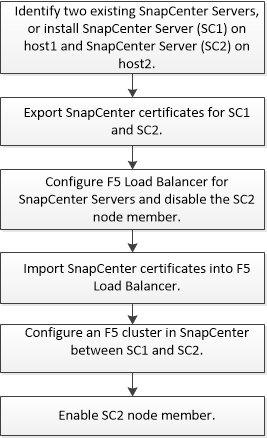

= Configurare i server SnapCenter per l'alta disponibilità utilizzando F5
:allow-uri-read: 
:icons: font
:imagesdir: ../media/

[role="lead"]
Per supportare l'alta disponibilità (ha) in SnapCenter, è possibile installare il bilanciamento del carico F5. F5 consente al server SnapCenter di supportare configurazioni Active-passive in un massimo di due host che si trovano nella stessa posizione. Per utilizzare F5 Load Balancer in SnapCenter, è necessario configurare i server SnapCenter e il bilanciamento del carico F5.

IMPORTANT: Se è stato eseguito l'aggiornamento da SnapCenter 4.2.x e in precedenza si utilizzava il bilanciamento del carico di rete (NLB), è possibile continuare a utilizzare tale configurazione o passare a F5.

L'immagine del flusso di lavoro elenca i passaggi per configurare i server SnapCenter per l'alta disponibilità utilizzando il bilanciamento del carico F5. Per istruzioni dettagliate, vedere https://kb.netapp.com/Advice_and_Troubleshooting/Data_Protection_and_Security/SnapCenter/How_to_configure_SnapCenter_Servers_for_high_availability_using_F5_Load_Balancer["Come configurare i server SnapCenter per l'alta disponibilità utilizzando F5 Load Balancer"^].

Per aggiungere e rimuovere i cluster F5, è necessario essere membri del gruppo amministratori locali sui server SnapCenter (oltre che essere assegnati al ruolo SnapCenterAdmin):

* Add-SmServerCluster
* Add-SmServer
* Remove-SmServerCluster
+
Per ulteriori informazioni, vedere https://library.netapp.com/ecm/ecm_download_file/ECMLP2886895["Guida di riferimento al cmdlet del software SnapCenter"^].

== Ulteriori informazioni sulla configurazione di F5

* Dopo aver installato e configurato SnapCenter per la disponibilità elevata, modificare il collegamento al desktop di SnapCenter in modo che punti all'IP del cluster F5.
* Se si verifica un failover tra i server SnapCenter e se esiste anche una sessione SnapCenter, chiudere il browser e accedere nuovamente a SnapCenter.
* Nella configurazione del bilanciamento del carico (NLB o F5), se si aggiunge un nodo parzialmente risolto dal nodo NLB o F5 e se il nodo SnapCenter non è in grado di raggiungere questo nodo, la pagina host SnapCenter passa spesso dallo stato di inattività a quello di esecuzione. Per risolvere questo problema, assicurarsi che entrambi i nodi SnapCenter siano in grado di risolvere l'host nel nodo NLB o F5.
* I comandi SnapCenter per le impostazioni MFA devono essere eseguiti su tutti i nodi. La configurazione della parte di base deve essere eseguita nel server Active Directory Federation Services (ad FS) utilizzando i dettagli del cluster F5. L'accesso all'interfaccia utente SnapCenter a livello di nodo viene bloccato dopo l'attivazione dell'MFA.
* Durante il failover, le impostazioni del registro di controllo non si rifletteranno sul secondo nodo. Pertanto, è necessario ripetere manualmente le impostazioni del registro di controllo sul nodo F5 passivo quando diventa attivo.

