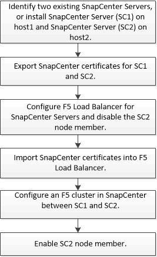

= Configurare i server SnapCenter per la disponibilità elevata
:allow-uri-read: 
:icons: font
:imagesdir: ../media/

[role="lead"]
Per supportare l'alta disponibilità (ha) in SnapCenter in esecuzione su Windows o su Linux, è possibile installare il bilanciamento del carico F5. F5 consente al server SnapCenter di supportare configurazioni Active-passive in un massimo di due host che si trovano nella stessa posizione. Per utilizzare F5 Load Balancer in SnapCenter, è necessario configurare i server SnapCenter e il bilanciamento del carico F5.

È inoltre possibile configurare il bilanciamento del carico di rete (NLB) per impostare la disponibilità elevata di SnapCenter. È necessario configurare manualmente NLB al di fuori dell'installazione di SnapCenter per garantire la disponibilità elevata.

Per gli ambienti cloud, è possibile configurare l'high Availability utilizzando l'Elastic Load Balancing (ELB) di Amazon Web Services (AWS) e il bilanciamento del carico di Azure.

[role="tabbed-block"]
====
.Configurare la disponibilità elevata utilizzando F5
--
L'immagine del flusso di lavoro elenca i passaggi per configurare i server SnapCenter per l'alta disponibilità utilizzando il bilanciamento del carico F5. Per istruzioni dettagliate, fare riferimento alla https://kb.netapp.com/Advice_and_Troubleshooting/Data_Protection_and_Security/SnapCenter/How_to_configure_SnapCenter_Servers_for_high_availability_using_F5_Load_Balancer["Come configurare i server SnapCenter per l'alta disponibilità utilizzando F5 Load Balancer"^].

Per aggiungere e rimuovere i cluster F5, è necessario essere membri del gruppo amministratori locali sui server SnapCenter (oltre che essere assegnati al ruolo SnapCenterAdmin):

* Add-SmServerCluster
* Add-SmServer
* Remove-SmServerCluster
+
Per ulteriori informazioni, fare riferimento a https://docs.netapp.com/us-en/snapcenter-cmdlets/index.html["Guida di riferimento al cmdlet del software SnapCenter"^].

Ulteriori informazioni

* Dopo aver installato e configurato SnapCenter per la disponibilità elevata, modificare il collegamento al desktop di SnapCenter in modo che punti all'IP del cluster F5.
* Se si verifica un failover tra i server SnapCenter e se esiste anche una sessione SnapCenter, chiudere il browser e accedere nuovamente a SnapCenter.
* Nell'impostazione del bilanciamento del carico (NLB o F5), se si aggiunge un host parzialmente risolto dall'host NLB o F5 e se l'host SnapCenter non è in grado di raggiungere questo host, la pagina host SnapCenter passa frequentemente dallo stato inattivo allo stato in esecuzione. Per risolvere questo problema, è necessario assicurarsi che entrambi gli host SnapCenter siano in grado di risolvere l'host in NLB o F5 host.
* I comandi SnapCenter per le impostazioni MFA devono essere eseguiti su tutti gli host. La configurazione della parte di base deve essere eseguita nel server Active Directory Federation Services (ad FS) utilizzando i dettagli del cluster F5. L'accesso all'interfaccia utente SnapCenter a livello di host viene bloccato dopo l'attivazione di MFA.
* Durante il failover, le impostazioni del registro di controllo non verranno applicate al secondo host. Pertanto, è necessario ripetere manualmente le impostazioni del registro di controllo sull'host passivo F5 quando diventa attivo.

--
.Configurare la disponibilità elevata utilizzando il bilanciamento del carico di rete (NLB)
--
È possibile configurare il bilanciamento del carico di rete (NLB, Network Load Balancing) per impostare la disponibilità elevata di SnapCenter. È necessario configurare manualmente NLB al di fuori dell'installazione di SnapCenter per garantire la disponibilità elevata.

Per informazioni su come configurare il bilanciamento del carico di rete (NLB) con SnapCenter, fare riferimento a https://kb.netapp.com/Advice_and_Troubleshooting/Data_Protection_and_Security/SnapCenter/How_to_configure_NLB_and_ARR_with_SnapCenter["Come configurare NLB con SnapCenter"^].

--
.Configurare l'high Availability utilizzando il bilanciamento del carico elastico (ELB) di AWS
--
Puoi configurare un ambiente SnapCenter a disponibilità elevata in Amazon Web Services (AWS) configurando due server SnapCenter in zone di disponibilità separate e configurandoli per il failover automatico. L'architettura include indirizzi IP privati virtuali, tabelle di routing e sincronizzazione tra database MySQL attivi e in standby.

.Fasi
. Configurare l'IP overlay privato virtuale in AWS. Per informazioni, fare riferimento alla https://docs.aws.amazon.com/vpc/latest/userguide/replace-local-route-target.html["Configurare l'IP overlay privato virtuale"^].
. Preparare l'host Windows
+
.. Forza IPv4 con priorità superiore a IPv6:
+
*** Posizione: HKLM\SYSTEM\CurrentControlSet\Services\Tcpip6\Parameters
*** Chiave: DisabledComponents
*** Digitare: REG_DWORD
*** Valore: 0x20

.. Assicurarsi che i nomi di dominio completi possano essere risolti tramite DNS o tramite la configurazione dell'host locale agli indirizzi IPv4.
.. Assicurarsi di non avere un proxy di sistema configurato.
.. Assicurarsi che la password dell'amministratore sia la stessa su entrambi i server Windows quando si utilizza un'installazione senza Active Directory e che i server non si trovino in un dominio.
.. Aggiungere un IP virtuale su entrambi i server Windows.

. Creare il cluster SnapCenter.
+
.. Avvia PowerShell e connettiti a SnapCenter.
`Open-SmConnection`
.. Creare il cluster.
`Add-SmServerCluster -ClusterName <cluster_name> -ClusterIP <cluster_ip> -PrimarySCServerIP <primary_ip> -Verbose -Credential administrator`
.. Aggiungere il server secondario.
`Add-SmServer -ServerName <server_name> -ServerIP <server_ip> -CleanUpSecondaryServer -Verbose -Credential administrator`
.. Scopri i dettagli sull'alta disponibilità.
`Get-SmServerConfig`

. Creare la funzione Lamda per regolare la tabella di routing nel caso in cui l'endpoint IP privato virtuale non sia disponibile, monitorato da AWS CloudWatch. Per informazioni, fare riferimento alla https://docs.aws.amazon.com/lambda/latest/dg/getting-started.html#getting-started-create-function["Creare una funzione Lambda"^].
. Creare un monitor in CloudWatch per monitorare la disponibilità dell'endpoint SnapCenter. Un allarme è configurato per attivare una funzione Lambda se l'endpoint non è raggiungibile. La funzione Lambda regola la tabella di routing per reindirizzare il traffico al server SnapCenter attivo. Per informazioni, fare riferimento alla https://docs.aws.amazon.com/AmazonCloudWatch/latest/monitoring/CloudWatch_Synthetics_Canaries_Create.html["Creare canari sintetici"^].
. Implementare il flusso di lavoro utilizzando una funzione STEP come alternativa al monitoraggio di CloudWatch, fornendo tempi di failover ridotti. Il flusso di lavoro include una funzione sonda lambda per verificare l'URL SnapCenter, una tabella DynamoDB per la memorizzazione dei conteggi degli errori e la funzione Step stessa.
+
.. Utilizzare una funzione lambda per esaminare l'URL SnapCenter. Per informazioni, fare riferimento alla https://docs.aws.amazon.com/lambda/latest/dg/getting-started.html["Crea funzione Lambda"^].
.. Creare una tabella DynamoDB per memorizzare il conteggio degli errori tra due iterazioni della funzione Step. Per informazioni, fare riferimento alla https://docs.aws.amazon.com/amazondynamodb/latest/developerguide/GettingStartedDynamoDB.html["Iniziate con la tabella DynamoDB"^].
.. Creare la funzione Step. Per informazioni, fare riferimento alla https://docs.aws.amazon.com/step-functions/["Documentazione della funzione STEP"^].
.. Eseguire il test di una singola fase.
.. Testare la funzione completa.
.. Creare un ruolo IAM e regolare le autorizzazioni per eseguire la funzione Lambda.
.. Creare un programma per attivare la funzione Step (fase). Per informazioni, fare riferimento alla https://docs.aws.amazon.com/step-functions/latest/dg/using-eventbridge-scheduler.html["Utilizzo di Amazon EventBridge Scheduler per avviare le funzioni Step"^].

--
.Configurare la high Availability utilizzando il bilanciamento del carico di Azure
--
Puoi configurare un ambiente SnapCenter ad alta disponibilità usando il bilanciamento del carico Azure.

.Fasi
. Crea macchine virtuali in un set scale utilizzando il portale di Azure. Il set di scalabilità delle macchine virtuali Azure consente di creare e gestire un gruppo di macchine virtuali con bilanciamento del carico. Il numero di istanze di macchine virtuali può aumentare o diminuire automaticamente in risposta alla richiesta o a una pianificazione definita. Per informazioni, fare riferimento alla https://learn.microsoft.com/en-us/azure/virtual-machine-scale-sets/flexible-virtual-machine-scale-sets-portal["Crea macchine virtuali in un set scale utilizzando il portale di Azure"^].
. Dopo aver configurato le macchine virtuali, accedere a ciascuna macchina virtuale nel set di macchine virtuali e installare il server SnapCenter in entrambi i nodi.
. Creare il cluster nell'host 1.
`Add-SmServerCluster -ClusterName <cluster_name> -ClusterIP <specify the load balancer front end virtual ip> -PrimarySCServerIP <ip address> -Verbose -Credential <credentials>`
. Aggiungere il server secondario.
`Add-SmServer -ServerName <name of node2> -ServerIP <ip address of node2> -Verbose -Credential <credentials>`
. Ottenere i dettagli sull'alta disponibilità.
`Get-SmServerConfig`
. Se necessario, ricostruire l'host secondario.
`Set-SmRepositoryConfig -RebuildSlave -Verbose`
. Eseguire il failover sul secondo host.
`Set-SmRepositoryConfig ActiveMaster <name of node2> -Verbose`

--
== passare da NLB a F5 per l'alta disponibilità

È possibile modificare la configurazione SnapCenter ha da bilanciamento del carico di rete (NLB) per utilizzare bilanciamento del carico F5.

*Fasi*

. Configurare i server SnapCenter per la disponibilità elevata utilizzando F5. https://kb.netapp.com/Advice_and_Troubleshooting/Data_Protection_and_Security/SnapCenter/How_to_configure_SnapCenter_Servers_for_high_availability_using_F5_Load_Balancer["Scopri di più"^].
. Sull'host del server SnapCenter, avviare PowerShell.
. Avviare una sessione utilizzando il cmdlet Open-SmConnection, quindi immettere le credenziali.
. Aggiornare il server SnapCenter in modo che punti all'indirizzo IP del cluster F5 utilizzando il cmdlet Update-SmServerCluster.
+
Le informazioni relative ai parametri che possono essere utilizzati con il cmdlet e le relative descrizioni possono essere ottenute eseguendo _Get-Help command_name_. In alternativa, fare riferimento anche a https://docs.netapp.com/us-en/snapcenter-cmdlets/index.html["Guida di riferimento al cmdlet del software SnapCenter"^].

====