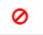

= Aggiunta di licenze SnapCenter basate su controller standard
:allow-uri-read: 
:icons: font
:imagesdir: ../media/

[role="lead"]
Se si utilizzano i controller di storage FAS, AFF o ASA, è necessaria una licenza basata su controller standard SnapCenter.

La licenza basata su controller ha le seguenti caratteristiche:

* Diritto standard SnapCenter incluso con l'acquisto di bundle premium o flash (non con il pacchetto base)
* Utilizzo illimitato dello storage
* Aggiunto direttamente al controller di archiviazione FAS, AFF o ASA tramite ONTAP System Manager o ONTAP CLI.
+

NOTE: Per le licenze basate sul controller SnapCenter non è necessario immettere alcuna informazione sulla licenza nell'interfaccia utente SnapCenter .

* Bloccato sul numero di serie del controller

Per informazioni sulle licenze richieste, vedere link:../get-started/concept_snapcenter_licenses.html["Licenze SnapCenter"].

== Fase 1: Verificare che la licenza della suite SnapManager sia installata

È possibile utilizzare l'interfaccia utente SnapCenter per verificare se una licenza SnapManager Suite è installata sui sistemi di archiviazione primari FAS, AFF o ASA e identificare quali sistemi necessitano di licenze.  Le licenze di SnapManager Suite si applicano solo a SVM o cluster FAS, AFF e ASA su sistemi di storage primari.

NOTE: Se sul controller è già presente una licenza SnapManager Suite, SnapCenter fornisce automaticamente il diritto alla licenza Standard basata sul controller.  I nomi licenza SnapManagerSuite e licenza basata su controller SnapCenter Standard vengono utilizzati in modo intercambiabile, ma si riferiscono alla stessa licenza.

.Fasi
. Nel riquadro di navigazione a sinistra, selezionare *Storage Systems*.
. Nella pagina Storage Systems (sistemi storage), dal menu a discesa *Type* (tipo), selezionare se visualizzare tutte le SVM o i cluster aggiunti:
+
** Per visualizzare tutte le SVM aggiunte, selezionare *ONTAP SVM*.
** Per visualizzare tutti i cluster aggiunti, selezionare *ONTAP Clusters*.
+
Quando si seleziona il nome del cluster, tutte le SVM che fanno parte del cluster vengono visualizzate nella sezione Storage Virtual Machines (macchine virtuali di storage).

. Nell'elenco Storage Connections (connessioni storage), individuare la colonna Controller License (licenza controller).
+
La colonna Controller License (licenza controller) visualizza il seguente stato:

+
** image:../media/controller_licensed_icon.gif["Icona di un segno di spunta"] Indica che una licenza della suite SnapManager è installata su un sistema di storage primario FAS, AFF o ASA.
**  Indica che la licenza della suite SnapManager non è installata su un sistema di storage primario FAS, AFF o ASA.
** Non applicabile indica che una licenza della suite SnapManager non è applicabile perché lo storage controller è su Amazon FSX per piattaforme di storage NetApp ONTAP, Cloud Volumes ONTAP, ONTAP Select o secondarie.

== Fase 2: Identificare le licenze installate sul controller

È possibile utilizzare la riga di comando ONTAP per visualizzare tutte le licenze installate sul controller. È necessario essere un amministratore del cluster nel sistema FAS, AFF o ASA.

NOTE: Il controller visualizza la licenza basata sul controller SnapCenter Standard come licenza SnapManagerSuite.

.Fasi
. Accedere al controller NetApp utilizzando la riga di comando ONTAP.
. Immettere il comando license show, quindi visualizzare l'output per verificare se la licenza SnapManagerSuite è installata.
+
.Output di esempio
[%collapsible]
====
[listing]
----
cluster1::> license show
(system license show)

Serial Number: 1-80-0000xx
Owner: cluster1
Package           Type     Description              Expiration
----------------- -------- ---------------------    ---------------
Base              site     Cluster Base License     -

Serial Number: 1-81-000000000000000000000000xx
Owner: cluster1-01
Package           Type     Description              Expiration
----------------- -------- ---------------------    ---------------
NFS               license  NFS License              -
CIFS              license  CIFS License             -
iSCSI             license  iSCSI License            -
FCP               license  FCP License              -
SnapRestore       license  SnapRestore License      -
SnapMirror        license  SnapMirror License       -
FlexClone         license  FlexClone License        -
SnapVault         license  SnapVault License        -
SnapManagerSuite  license  SnapManagerSuite License -
----
====
+
Nell'esempio, la licenza SnapManagerSuite è installata, pertanto non sono richieste ulteriori azioni di licenza SnapCenter.

== Fase 3: Recuperare il numero di serie del controller

Ottenere il numero di serie del controller utilizzando la riga di comando ONTAP .  Per ottenere il numero di serie della licenza basata sul controller, è necessario essere un amministratore del cluster sul sistema FAS, AFF o ASA .

.Fasi
. Accedere al controller utilizzando la riga di comando ONTAP.
. Immettere il comando show -instance del sistema, quindi esaminare l'output per individuare il numero di serie del controller.
+
.Output di esempio
[%collapsible]
====
[listing]
----
cluster1::> system show -instance

Node: fasxxxx-xx-xx-xx
Owner:
Location: RTP 1.5
Model: FAS8080
Serial Number: 123451234511
Asset Tag: -
Uptime: 143 days 23:46
NVRAM System ID: xxxxxxxxx
System ID: xxxxxxxxxx
Vendor: NetApp
Health: true
Eligibility: true
Differentiated Services: false
All-Flash Optimized: false

Node: fas8080-41-42-02
Owner:
Location: RTP 1.5
Model: FAS8080
Serial Number: 123451234512
Asset Tag: -
Uptime: 144 days 00:08
NVRAM System ID: xxxxxxxxx
System ID: xxxxxxxxxx
Vendor: NetApp
Health: true
Eligibility: true
Differentiated Services: false
All-Flash Optimized: false
2 entries were displayed.
----
====
. Annotare i numeri di serie.

== Fase 4: Recuperare il numero di serie della licenza basata su controller

Se si utilizza un archivio FAS, ASA o AFF , è possibile recuperare la licenza basata sul controller SnapCenter dal sito di supporto NetApp prima di installarla utilizzando la riga di comando ONTAP .

.Prima di iniziare
* È necessario disporre di credenziali di accesso al sito di supporto NetApp valide.
+
Se non inserisci credenziali valide, il sistema non restituirà alcuna informazione per la tua ricerca.

* Il numero di serie del controller dovrebbe essere disponibile.

.Fasi
. Accedere a. http://mysupport.netapp.com/["Sito di supporto NetApp"^].
. Accedere a *sistemi* > *licenze software*.
. Nell'area Selection Criteria (Criteri di selezione), assicurarsi che sia selezionato Serial Number (numero di serie) (situato sul retro dell'unità), inserire il numero di serie del controller, quindi selezionare *Go!* (Vai).
+
image::../media/nss_controller_license_select.gif[Schermata dei criteri di selezione e dell'immissione del numero di serie.]

+
Viene visualizzato un elenco di licenze per il controller specificato.

. Individuare e registrare la licenza di SnapCenter o SnapManagerSuite.

== Fase 5: Aggiungere una licenza basata su controller

È possibile utilizzare la riga di comando ONTAP per aggiungere una licenza basata su controller SnapCenter quando si utilizzano sistemi FAS, AFF o ASA e si dispone di una licenza SnapCenter o SnapManagerSuite.

.Prima di iniziare
* È necessario essere un amministratore del cluster nel sistema FAS, AFF o ASA.
* È necessario disporre della licenza standard o SnapManagerSuite di SnapCenter.

.A proposito di questa attività
Se si desidera installare SnapCenter in prova con storage FAS, AFF o ASA, è possibile ottenere una licenza di valutazione Premium Bundle da installare sul controller.

Se si desidera installare SnapCenter in prova, contattare il rappresentante commerciale per ottenere una licenza di valutazione del bundle Premium da installare sul controller.

.Fasi
. Accedere al cluster NetApp utilizzando la riga di comando ONTAP.
. Aggiungere la chiave di licenza SnapManagerSuite:
+
`system license add -license-code license_key`

+
Questo comando è disponibile a livello di privilegio admin.

. Verificare che la licenza SnapManagerSuite sia installata:
+
`license show`

== Fase 6: Rimuovere la licenza di prova

Se si utilizza una licenza SnapCenter Standard basata su controller e si ha bisogno di rimuovere la licenza di prova basata sulla capacità (numero di serie che termina con "`50`"), è necessario utilizzare i comandi MySQL per rimuovere manualmente la licenza di prova.  La licenza di prova non può essere eliminata tramite l'interfaccia utente SnapCenter .

NOTE: La rimozione manuale di una licenza di prova è necessaria solo se si utilizza una licenza basata su controller standard SnapCenter.

.Fasi
. Sul server SnapCenter, aprire una finestra PowerShell per reimpostare la password MySQL.
+
.. Eseguire il cmdlet Open-SmConnection per stabilire una connessione con SnapCenter Server per un account SnapCenterAdmin.
.. Eseguire Set-SmRepositoryPassword per reimpostare la password MySQL.
+
Per informazioni sui cmdlet, vedere https://docs.netapp.com/us-en/snapcenter-cmdlets/index.html["Guida di riferimento al cmdlet del software SnapCenter"^] .

. Aprire il prompt dei comandi ed eseguire mysql -u root -p per accedere a MySQL.
+
MySQL richiede la password. Immettere le credenziali fornite durante la reimpostazione della password.

. Rimuovere la licenza di prova dal database:
+
`use nsm;DELETE FROM nsm_License WHERE nsm_License_Serial_Number='510000050';`

