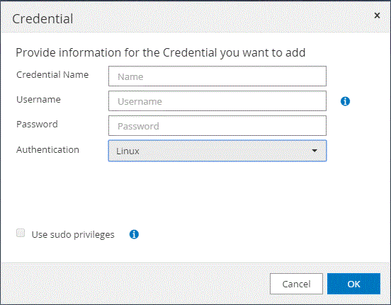

= Impostare le credenziali per il plug-in SnapCenter per il database SAP HANA
:allow-uri-read: 
:icons: font
:imagesdir: ../media/

[role="lead"]
SnapCenter utilizza le credenziali per autenticare gli utenti per le operazioni SnapCenter. È necessario creare credenziali per l'installazione dei plug-in SnapCenter e credenziali aggiuntive per l'esecuzione delle operazioni di protezione dei dati su database o file system Windows.

*A proposito di questa attività*

* Host Linux
+
È necessario impostare le credenziali per l'installazione dei plug-in sugli host Linux.

+
Per installare e avviare il processo di plug-in, è necessario impostare le credenziali per l'utente root o per un utente non root che dispone dei privilegi di sudo.

+
|===

| *Best practice:* sebbene sia consentito creare credenziali per Linux dopo l'implementazione degli host e l'installazione dei plug-in, la Best practice consiste nel creare credenziali dopo l'aggiunta di SVM, prima di distribuire host e installare plug-in. 
|===
* Host Windows
+
Prima di installare i plug-in, è necessario impostare le credenziali di Windows.

+
È necessario impostare le credenziali con privilegi di amministratore, inclusi i diritti di amministratore sull'host remoto.

Se si impostano le credenziali per singoli gruppi di risorse e il nome utente non dispone di privilegi di amministratore completi, è necessario assegnare almeno il gruppo di risorse e i privilegi di backup al nome utente.

*Fasi*

. Nel riquadro di spostamento di sinistra, fare clic su *Impostazioni*.
. Nella pagina Impostazioni, fare clic su *credenziale*.
. Fare clic su *nuovo*.
+

. Nella pagina credenziale, specificare le informazioni necessarie per la configurazione delle credenziali:
+
|===
| Per questo campo... | Eseguire questa operazione... 

 a| 
Nome della credenziale
 a| 
Immettere un nome per le credenziali.

 a| 
Nome utente
 a| 
Immettere il nome utente e la password da utilizzare per l'autenticazione.

** Amministratore di dominio o qualsiasi membro del gruppo di amministratori
+
Specificare l'amministratore di dominio o qualsiasi membro del gruppo di amministratori nel sistema in cui si installa il plug-in SnapCenter. I formati validi per il campo Nome utente sono:

+
*** _NetBIOS/nome utente_
*** _Dominio FQDN/nome utente_

** Amministratore locale (solo per gruppi di lavoro)
+
Per i sistemi appartenenti a un gruppo di lavoro, specificare l'amministratore locale incorporato nel sistema in cui si installa il plug-in SnapCenter. È possibile specificare un account utente locale che appartiene al gruppo di amministratori locali se l'account utente dispone di privilegi elevati o se la funzione di controllo dell'accesso utente è disattivata sul sistema host. Il formato valido per il campo Nome utente è: _Nome utente_

+
Non utilizzare virgolette doppie (") o backtick (`) nelle password. Non utilizzare il valore inferiore a (<) e il punto esclamativo (!) simboli insieme nelle password. Ad esempio, meno di<!10, meno di 10<!, backtick`12.

 a| 
Password
 a| 
Inserire la password utilizzata per l'autenticazione.

 a| 
Modalità di autenticazione
 a| 
Selezionare la modalità di autenticazione che si desidera utilizzare.

 a| 
Utilizzare i privilegi sudo
 a| 
Selezionare la casella di controllo *Usa privilegi sudo* se si stanno creando credenziali per un utente non root.

NOTE: Applicabile solo agli utenti Linux.

|===
. Fare clic su *OK*.

Al termine dell'impostazione delle credenziali, è possibile assegnare la manutenzione delle credenziali a un utente o a un gruppo di utenti nella pagina User and Access (utenti e accesso).
