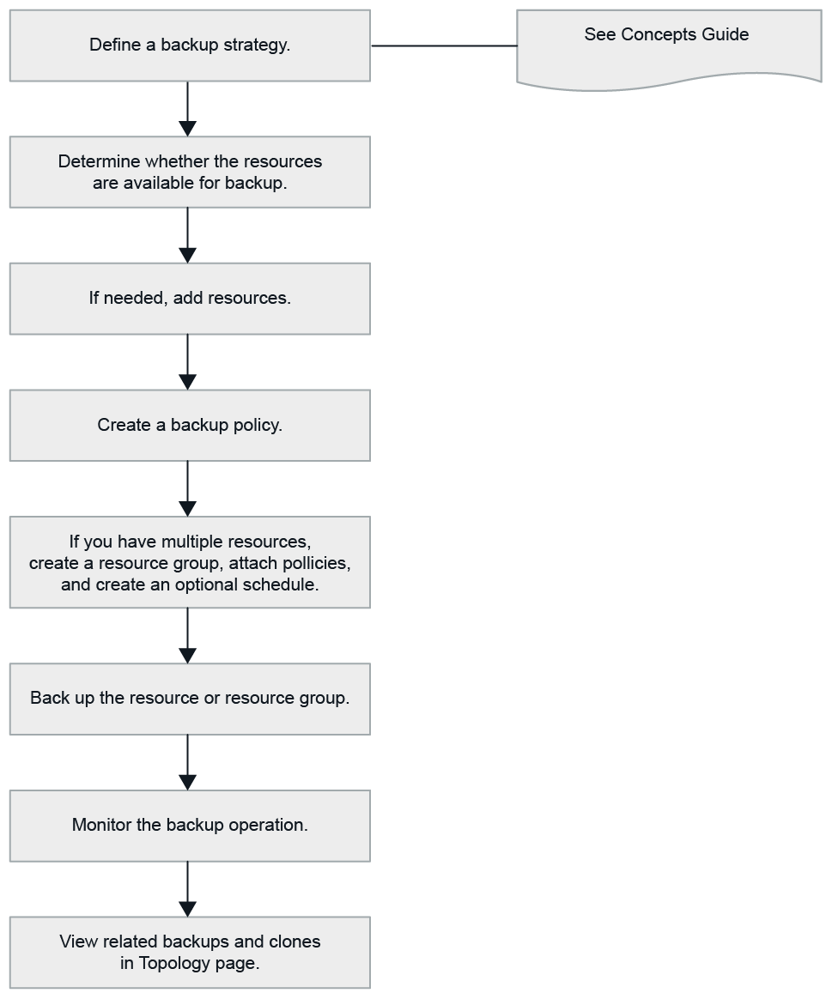

= Eseguire il backup delle risorse PostgreSQL
:allow-uri-read: 
:icons: font
:imagesdir: ../media/

[role="lead"]
È possibile creare un backup di una risorsa (cluster) o di un gruppo di risorse. Il workflow di backup comprende planning, identificazione dei cluster per il backup, gestione dei criteri di backup, creazione di gruppi di risorse e aggiunta di criteri, creazione di backup e monitoraggio delle operazioni.

Il seguente flusso di lavoro mostra la sequenza in cui è necessario eseguire l'operazione di backup:

È inoltre possibile utilizzare i cmdlet PowerShell manualmente o negli script per eseguire operazioni di backup, ripristino e clonazione. La guida in linea del cmdlet di SnapCenter e le informazioni di riferimento del cmdlet contengono ulteriori informazioni sui cmdlet di PowerShell. https://docs.netapp.com/us-en/snapcenter-cmdlets/index.html["Guida di riferimento al cmdlet del software SnapCenter"^].
