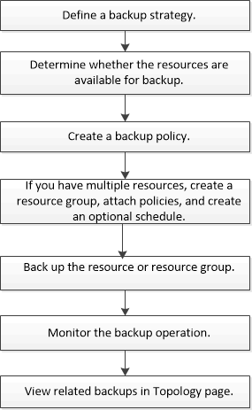

= Workflow di backup
:allow-uri-read: 
:icons: font
:imagesdir: ../media/

[role="lead"]
Quando si installa il plug-in SnapCenter per Microsoft Exchange Server nell'ambiente in uso, è possibile utilizzare SnapCenter per eseguire il backup delle risorse Exchange.

È possibile pianificare più backup per l'esecuzione simultanea tra i server. Le operazioni di backup e ripristino non possono essere eseguite contemporaneamente sulla stessa risorsa. Le copie di backup attive e passive sullo stesso volume non sono supportate.

Il seguente flusso di lavoro mostra la sequenza in cui è necessario eseguire l'operazione di backup:

