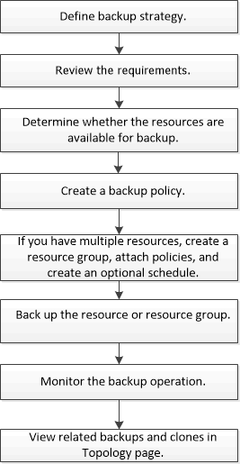

= Panoramica della procedura di backup
:allow-uri-read: 
:icons: font
:imagesdir: ../media/

[role="lead"]
È possibile creare un backup di una risorsa (database) o di un gruppo di risorse. La procedura di backup include la pianificazione, l'identificazione delle risorse per il backup, la creazione di policy di backup, la creazione di gruppi di risorse e l'aggiunta di policy, la creazione di backup e il monitoraggio delle operazioni.

Il seguente flusso di lavoro mostra la sequenza in cui è necessario eseguire l'operazione di backup:

Durante la creazione di un backup per i database Oracle, viene creato un file di blocco operativo (_.SM_lock_dbsid_) sull'host del database Oracle nella directory _/var/opt/snapcenter/sco/lock_ per evitare l'esecuzione di più operazioni sul database. Una volta eseguito il backup del database, il file di blocco operativo viene rimosso automaticamente.

Tuttavia, se il backup precedente è stato completato con un avviso, il file di blocco operativo potrebbe non essere cancellato e l'operazione di backup successiva viene inserita nella coda di attesa. Potrebbe essere annullato se il file *.SM_lock_dbsid* non viene cancellato. In questo scenario, è necessario eliminare manualmente il file di blocco operativo eseguendo le seguenti operazioni:

. Dal prompt dei comandi, selezionare _/var/opt/snapcenter/sco/lock_.
. Eliminare il blocco operativo:``rm -rf .sm_lock_dbsid.``

