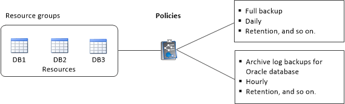

= Utilizzo di risorse, gruppi di risorse e policy per la protezione dei database Oracle
:allow-uri-read: 
:icons: font
:imagesdir: ../media/

[role="lead"]
Prima di utilizzare SnapCenter, è utile comprendere i concetti di base relativi alle operazioni di backup, clonazione e ripristino che si desidera eseguire.

* In genere, le risorse sono database Oracle in SnapCenter.
* Un gruppo di risorse SnapCenterè un insieme di risorse su un host o cluster.
+
Quando si esegue un'operazione su un gruppo di risorse, tale operazione viene eseguita sulle risorse definite nel gruppo di risorse.

+
I gruppi di risorse erano precedentemente noti come set di dati.

* I criteri specificano la frequenza di backup, la conservazione delle copie, la replica, gli script e altre caratteristiche delle operazioni di protezione dei dati.
+
Quando si crea un gruppo di risorse, si selezionano uno o più criteri per tale gruppo. È inoltre possibile selezionare un criterio quando si esegue un backup su richiesta per una singola risorsa. È inoltre possibile eseguire backup pianificati per singole risorse e gruppi di risorse.

Un gruppo di risorse definisce _cosa_ si desidera proteggere e quando si desidera proteggerlo in termini di giorno e ora. Pensa a una policy come a definire _come_ la vuoi proteggere.

Ad esempio, se si esegue il backup di tutti i database di un host, è possibile creare un gruppo di risorse che includa tutti i database dell'host. È quindi possibile associare due criteri al gruppo di risorse: Una policy giornaliera e una policy oraria. Quando si crea il gruppo di risorse e si allegano i criteri, è possibile configurare il gruppo di risorse in modo che esegua un backup completo ogni giorno e un altro programma che esegua i backup del registro ogni ora.

L'immagine seguente illustra la relazione tra risorse, gruppi di risorse e criteri per i database:

