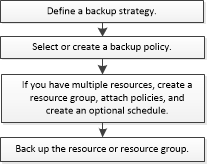

= Workflow di backup
:allow-uri-read: 
:icons: font
:imagesdir: ../media/

[role="lead"]
Quando si installa il plug-in SnapCenter per Microsoft SQL Server nell'ambiente in uso, è possibile utilizzare SnapCenter per eseguire il backup delle risorse di SQL Server.

È possibile pianificare più backup per l'esecuzione simultanea tra i server.

Le operazioni di backup e ripristino non possono essere eseguite contemporaneamente sulla stessa risorsa.

Il seguente flusso di lavoro mostra la sequenza in cui è necessario eseguire le operazioni di backup:

NOTE: Le opzioni Backup Now (Backup ora), Restore (Ripristina), Manage Backup (Gestisci backup) e Clone (Clona) nella pagina Resources (risorse) sono disattivate se si seleziona un LUN non NetApp, un database danneggiato o un database da ripristinare.

È inoltre possibile utilizzare i cmdlet PowerShell manualmente o negli script per eseguire operazioni di backup, ripristino, ripristino, verifica e clonazione. Per informazioni dettagliate sui cmdlet di PowerShell, utilizzare la guida dei cmdlet di SnapCenter o vedere la https://docs.netapp.com/us-en/snapcenter-cmdlets/index.html["Guida di riferimento al cmdlet del software SnapCenter"]

== Come SnapCenter esegue il backup dei database

SnapCenter utilizza la tecnologia Snapshot per eseguire il backup dei database di SQL Server che risiedono su LUN o VMDK. SnapCenter crea il backup creando istantanee dei database.

Quando si seleziona un database per un backup completo del database dalla pagina risorse, SnapCenter seleziona automaticamente tutti gli altri database che risiedono nello stesso volume di storage. Se il LUN o VMDK memorizza solo un singolo database, è possibile cancellare o riselezionare il database singolarmente. Se il LUN o il VMDK ospita più database, è necessario cancellare o riselezionare i database come gruppo.

Viene eseguito il backup di tutti i database che risiedono su un singolo volume contemporaneamente utilizzando Snapshot. Se il numero massimo di database di backup simultanei è 35 e se più di 35 database risiedono in un volume di archiviazione, il numero totale di snapshot creati corrisponde al numero di database diviso per 35.

NOTE: È possibile configurare il numero massimo di database per ciascuna istantanea nel criterio di backup.

Quando SnapCenter crea una Snapshot, l'intero volume del sistema storage viene acquisito nella Snapshot. Tuttavia, il backup è valido solo per il server host SQL per il quale è stato creato il backup.

Se i dati di altri server host SQL si trovano sullo stesso volume, non è possibile ripristinarli dalla Snapshot.

*Ulteriori informazioni*

link:https://kb.netapp.com/Advice_and_Troubleshooting/Data_Protection_and_Security/SnapCenter/Quiesce_or_grouping_resources_operations_fail["Le operazioni di quiesce o raggruppamento delle risorse non riescono"]
