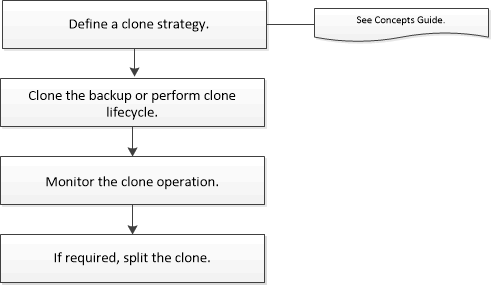

= Clonare il flusso di lavoro
:allow-uri-read: 
:icons: font
:imagesdir: ../media/

[role="lead"]
Prima di clonare le risorse di database da un backup, è necessario eseguire diverse attività utilizzando il server SnapCenter. La clonazione del database è il processo di creazione di una copia point-in-time di un database di produzione o del relativo set di backup. È possibile clonare i database per testare le funzionalità che devono essere implementate utilizzando la struttura e il contenuto del database corrente durante i cicli di sviluppo delle applicazioni, per utilizzare gli strumenti di estrazione e manipolazione dei dati durante il popolamento dei data warehouse o per ripristinare i dati cancellati o modificati erroneamente.

Un'operazione di clonazione del database genera report basati sugli ID lavoro.

Il seguente flusso di lavoro mostra la sequenza in cui è necessario eseguire le operazioni di cloning:

È anche possibile utilizzare i cmdlet di PowerShell manualmente o negli script per eseguire operazioni di backup, ripristino, recupero, verifica e clonazione. Per informazioni dettagliate sui cmdlet di PowerShell, utilizzare la guida del cmdlet SnapCenter o vedere https://docs.netapp.com/us-en/snapcenter-cmdlets/index.html["Guida di riferimento al cmdlet del software SnapCenter"].
